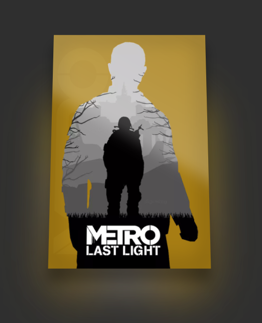

# css-testing

Just an repository of me testing css style stuff and creating stuff.

## Projects

### [Steam Library like card](/steam-library-card/)

- Metro Last Light picture from https://www.steamgriddb.com/grid/350918 and renamed to `MetroLL.png`
- Guide to create the 3d effects of the card: https://kushagra.dev/blog/css-only-3d-card/

### Gradient Text

- gradient code from: https://www.30secondsofcode.org/css/s/25-css-gradients/

## Animal Crossing New Leaf Colours

- Animal Crossing New Leaf Palette taken from:
  - https://docs.google.com/spreadsheets/d/1Th17nnkMpXDmnEenHSH-d66DdzttANLwtlvXfFhS-kw
  - https://gist.github.com/Wunkolo/e0e1c8fef98dfcee806b

